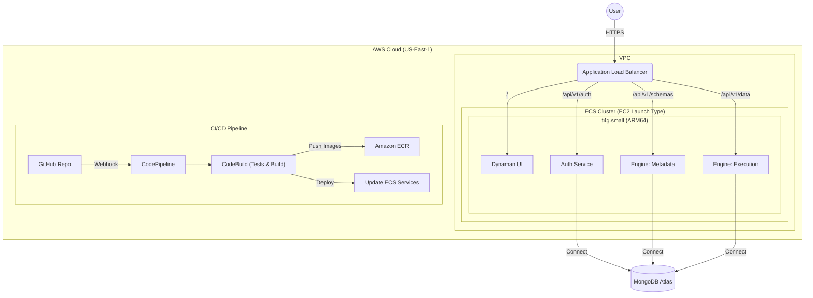

# Dynaman Infrastructure

This directory contains the Terraform configuration to deploy the Dynaman application to AWS ECS.

## Architecture



## Prerequisites

1.  **AWS CLI**: Installed and configured with `aws configure`.
2.  **Terraform**: Installed (v1.0+).
3.  **MongoDB Atlas**: A MongoDB cluster (Free Tier is fine) with a connection string.
4.  **GitHub Repo**: This code pushed to your GitHub repository.

## Setup

1.  **Variables**:
    Copy the example variables file:
    ```bash
    cp terraform/terraform.tfvars.example terraform/terraform.tfvars
    ```
    Edit `terraform/terraform.tfvars` and fill in your details (values must be in double quotes):
    *   `mongodb_url`: "Your Atlas connection string"
    *   `jwt_secret_key`: "A random string for security"
    *   `github_repo_owner`: "Your GitHub username"
    *   `github_repo_name`: "dynaman"

## Deployment (Start)

To provision the infrastructure and start the demo:

```bash
cd terraform
terraform init  # Only needed the first time
terraform apply
```
*Type `yes` to confirm.*

**After the first deployment:**
1.  Go to the **AWS CodePipeline Console**.
2.  Find `dynaman-pipeline`.
3.  You might need to authorize the **AWS Connector for GitHub** (if the Source stage shows "Pending").
4.  Once authorized, the pipeline will run:
    *   **Source**: Pulls code from GitHub.
    *   **Build**: Runs tests and builds Docker images (ARM64).
    *   **Deploy**: Updates ECS services.

**Accessing the App:**
Terraform will output `alb_dns_name` at the end. Open this URL in your browser.

## Stopping (Destroy)

To stop the demo and avoid costs (ALB, EC2, etc.):

```bash
cd terraform
terraform destroy
```
*Type `yes` to confirm.*

**Note:** This deletes all AWS resources including the Load Balancer and ECR images. Your MongoDB data (on Atlas) remains safe.

## Troubleshooting
*   **Pipeline Failures**: Check AWS CodeBuild logs.
*   **App Issues**: Check CloudWatch Logs (`/ecs/dynaman`).
